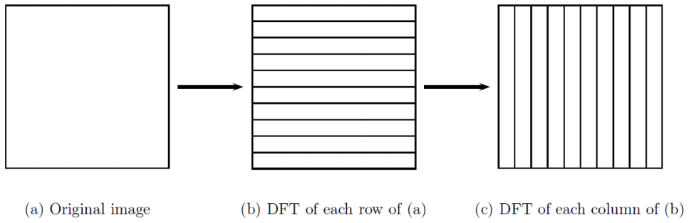
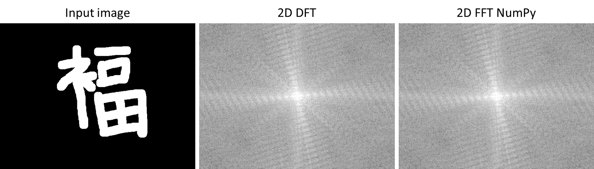
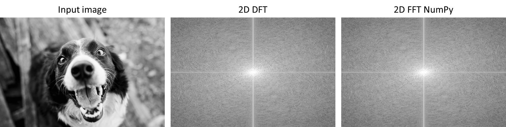

# DFT-scratch-numpy
Implementation of 1-D DFT 2 times row-wise and column-wise for transforming images from spatial domain to frequency domain from scratch using NumPy (but not using NumPy's built-in FFT function).  
  
Image taken from Prof Emmanuel Agu's [slide](https://web.cs.wpi.edu/~emmanuel/courses/cs545/S14/slides/lecture10.pdf) of Digital Image Processing (CS/ECE 545) Lecture 10: Discrete Fourier Transform (DFT).  

## Libraries you will need
This is implemented in Python so you will need the following Python libraries:
- cv2 (OpenCV)
- NumPy

## Usage
You need to `cd` to this folder and run:  
  
`python main.py 'path/to/your/image'`  
  
Change the 'path/to/your/image' to where your images are (that you wish to convert into frequency domain).  

## Results
Some important notes: this implementation will convert your RGB images to grayscale images, while the result of DFT and FFT is correct, shifting the DC frequency to the center (0, 0) still give incorrect results sometimes - compared to NumPy's built-in 2D FFT shift `np.fft.fftshift()`. You can see it on 'input1_DFT.png' and 'input1_FFT_NumPy.png' in 'images/' folder of this repository.  
  
  
  
